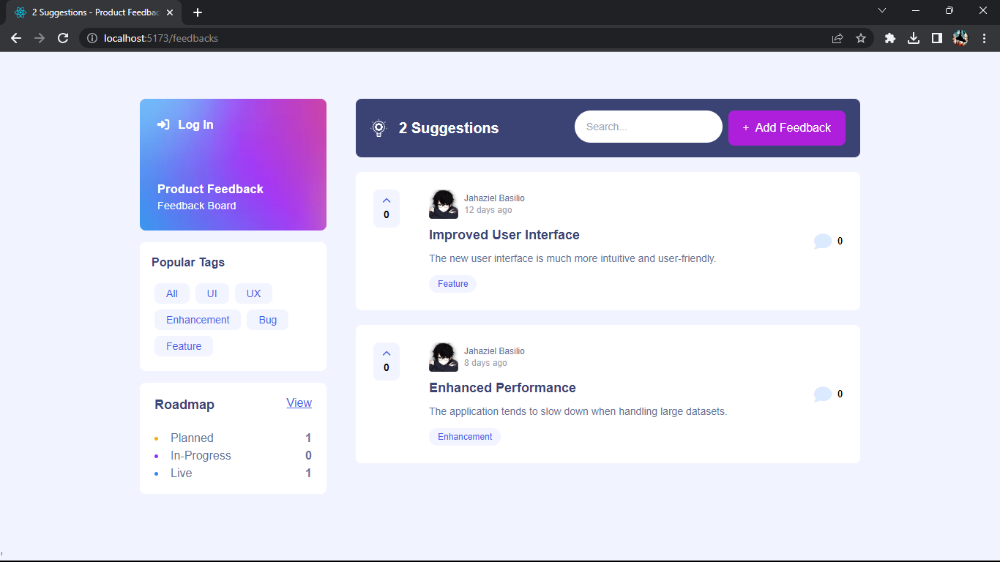

## 📝 Product Feedback App

Product Feedback App es una solución de software de vanguardia diseñada para agilizar y mejorar el proceso de recopilación, gestión y actuación en función de los comentarios de los clientes para empresas de todos los tamaños. Esta aplicación fácil de usar permite a las empresas fomentar relaciones más sólidas con sus clientes, tomar decisiones informadas sobre productos e impulsar la mejora continua.

## ⭐ Características

✅ Crear, leer, actualizar y eliminar solicitudes de comentarios sobre productos\
✅ Reciba validaciones de formulario cuando intente crear/editar solicitudes de comentarios\
✅ Filtrar sugerencias por categoría\
✅ Agregar comentarios y respuestas a una solicitud de comentarios sobre productos\
✅ Votar a favor las solicitudes de comentarios sobre productos

## 🛠️ Construido con Stack De Tecnologías

